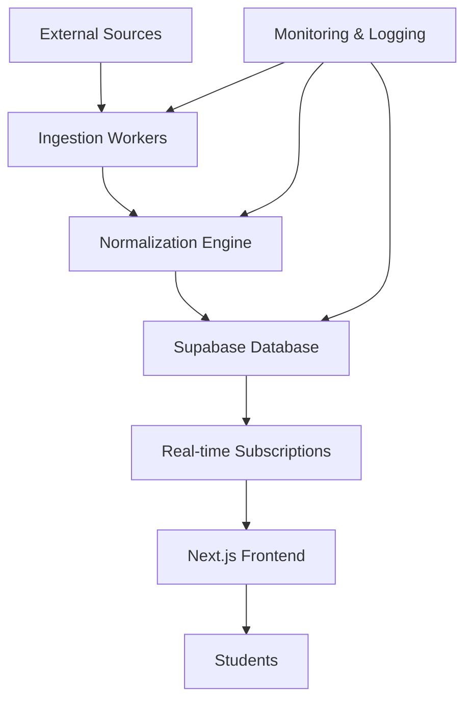

# Design Document

## Overview

InternTrack is architected as a student-focused internship aggregation system that sources directly from company career pages and official internship programs. Unlike generic job boards, it exclusively targets college internships with structured metadata (role type, eligibility year, application cycles, deadlines) to provide a clean, Excel-like filtering experience. The system prioritizes freshness by scraping company sites directly, ensuring students see opportunities before they appear on LinkedIn or other aggregators.

## Architecture

### High-Level Architecture



### Technology Stack (Glean-Inspired)

#### Core Framework Stack
- **Frontend**: Next.js (App Router) with React 18+
- **UI Components**: Shadcn UI + Tailwind CSS
- **Table Rendering**: TanStack Table + TanStack Virtual for performance
- **Data Fetching**: React Query (@tanstack/react-query) for caching
- **Database**: Supabase (Postgres + Realtime subscriptions)
- **Language**: TypeScript (strict mode)

#### Data & API Stack
- **Job Discovery**: Exa.ai API for intelligent web search
- **Websets**: Websets.exa.ai for structured job board data
- **Concurrency Control**: p-limit for rate limiting API calls
- **Ontology**: Custom normalization engine inspired by Palantir Foundry
- **Cold Email** (Future): Apollo for outreach workflows

### System Components (Glean-Style Architecture)

1. **Ingestion Layer**: Scheduled workers using Exa.ai/Websets APIs with p-limit concurrency control
2. **Ontology Layer**: Palantir-inspired data normalization and tagging system
3. **Data Layer**: Supabase Postgres with real-time subscriptions
4. **API Layer**: Next.js API routes for data access and filtering
5. **Frontend Layer**: React with TanStack Table, TanStack Virtual, and Shadcn UI
6. **Query Layer**: React Query for caching and optimistic updates
7. **Monitoring Layer**: Structured logging and error tracking

## Components and Interfaces

### Frontend Components

#### InternshipTable Component
- **Purpose**: Main virtualized table displaying internships
- **Props**: `filters`, `searchQuery`, `sortConfig`
- **State**: Uses TanStack Table with TanStack Virtual for performance
- **Real-time**: Subscribes to Supabase real-time updates via React Query

```typescript
interface InternshipTableProps {
  filters: FilterState;
  searchQuery: string;
  onInternshipClick: (internship: Internship) => void;
}
```

#### FilterPanel Component
- **Purpose**: Sidebar with role, location, and keyword filters
- **State**: Manages filter state with immediate UI updates
- **Integration**: Triggers table re-queries via React Query

```typescript
interface FilterState {
  roles: InternshipRole[];
  majors: string[]; // ['Computer Science', 'Business', 'Finance', etc.]
  locations: string[];
  isRemote?: boolean;
  workType: ('paid' | 'unpaid')[];
  eligibilityYear: string[]; // ['Freshman', 'Sophomore', etc.]
  internshipCycle: string[]; // ['Summer 2025', 'Fall 2024', etc.]
  postedWithin: 'day' | 'week' | 'month';
  showProgramSpecific?: boolean; // highlight special programs
}
```

#### InternshipDetail Component
- **Purpose**: Expandable detail view with full job description
- **Features**: Application links, deadline countdown, skill tags
- **Accessibility**: Proper ARIA labels and keyboard navigation

### Backend Components

#### Ingestion Worker
- **Trigger**: Scheduled every 15 minutes via cron or serverless function
- **Primary Sources**: Direct company career pages (top 200 internship-heavy companies)
- **Secondary Sources**: Program-specific pages (Google STEP, Microsoft Explore, etc.)
- **API Sources**: Greenhouse, Lever, Workday public feeds where available
- **Concurrency**: Uses p-limit to respect rate limits (max 3 concurrent requests per source)
- **Output**: Raw internship data sent to normalization pipeline

```typescript
interface RawInternshipData {
  source: string;
  sourceType: 'company_career_page' | 'program_page' | 'api_feed';
  url: string;
  title: string;
  company: string;
  description: string;
  location?: string;
  postedAt?: string;
  applicationUrl?: string;
  applicationDeadline?: string;
  internshipCycle?: string; // e.g., "Summer 2025", "Fall 2024"
  eligibilityYear?: string; // e.g., "Sophomore/Junior", "All years"
  rawPayload: Record<string, any>;
}
```

#### Ontology Engine (Palantir-Inspired)
- **Input**: Raw internship data from ingestion
- **Processing**: Extracts and standardizes role types, majors, locations, skills using structured ontology
- **Major Mapping**: Maps job requirements to relevant bachelor's degree majors
- **Deduplication**: Uses canonical hashing (title + company + location)
- **Tagging**: Applies consistent taxonomy for filtering and search
- **Output**: Normalized internship records with structured metadata

```typescript
interface NormalizedInternship {
  id: string;
  title: string;
  company: string;
  normalizedRole: InternshipRole;
  relevantMajors: string[]; // ['Computer Science', 'Business', 'Any', etc.]
  location: string;
  isRemote: boolean;
  workType: 'paid' | 'unpaid' | 'unknown';
  skills: string[];
  eligibilityYear: string[]; // ['Freshman', 'Sophomore', 'Junior', 'Senior']
  internshipCycle: string; // 'Summer 2025', 'Fall 2024', etc.
  postedAt: Date;
  applicationDeadline?: Date;
  applicationUrl: string;
  description: string;
  source: string;
  sourceType: 'company_career_page' | 'program_page' | 'api_feed';
  canonicalHash: string;
  isProgramSpecific: boolean; // true for special programs like Google STEP
}
```

### API Interfaces

#### GET /api/internships
- **Purpose**: Fetch filtered and paginated internships
- **Query Params**: `roles[]`, `locations[]`, `search`, `limit`, `offset`, `postedSince`
- **Response**: Paginated internship list with metadata
- **Caching**: React Query with 5-minute stale time

#### GET /api/internships/[id]
- **Purpose**: Fetch detailed internship information
- **Response**: Full internship details with normalized tags
- **Caching**: React Query with 30-minute stale time

## Data Models

### Database Schema

#### internships table
```sql
CREATE TABLE internships (
  id UUID PRIMARY KEY DEFAULT gen_random_uuid(),
  title TEXT NOT NULL,
  company_id UUID REFERENCES companies(id),
  source_id UUID REFERENCES sources(id),
  url TEXT NOT NULL,
  application_url TEXT,
  description TEXT,
  location TEXT,
  is_remote BOOLEAN DEFAULT false,
  work_type TEXT CHECK (work_type IN ('paid', 'unpaid', 'unknown')) DEFAULT 'unknown',
  posted_at TIMESTAMPTZ NOT NULL,
  application_deadline TIMESTAMPTZ,
  scraped_at TIMESTAMPTZ DEFAULT NOW(),
  normalized_role TEXT,
  relevant_majors TEXT[], -- ['Computer Science', 'Business', 'Finance', 'Any']
  skills TEXT[],
  eligibility_year TEXT[], -- ['Freshman', 'Sophomore', 'Junior', 'Senior']
  internship_cycle TEXT, -- 'Summer 2025', 'Fall 2024', etc.
  is_program_specific BOOLEAN DEFAULT false,
  source_type TEXT CHECK (source_type IN ('company_career_page', 'program_page', 'api_feed')),
  canonical_hash TEXT UNIQUE NOT NULL,
  is_archived BOOLEAN DEFAULT false,
  raw_payload JSONB,
  created_at TIMESTAMPTZ DEFAULT NOW(),
  updated_at TIMESTAMPTZ DEFAULT NOW()
);

-- Indexes for student-focused filtering
CREATE INDEX idx_internships_posted_at ON internships(posted_at DESC);
CREATE INDEX idx_internships_normalized_role ON internships(normalized_role);
CREATE INDEX idx_internships_relevant_majors ON internships USING gin(relevant_majors);
CREATE INDEX idx_internships_location ON internships(location);
CREATE INDEX idx_internships_is_remote ON internships(is_remote);
CREATE INDEX idx_internships_work_type ON internships(work_type);
CREATE INDEX idx_internships_eligibility_year ON internships USING gin(eligibility_year);
CREATE INDEX idx_internships_internship_cycle ON internships(internship_cycle);
CREATE INDEX idx_internships_is_program_specific ON internships(is_program_specific);
CREATE INDEX idx_internships_canonical_hash ON internships(canonical_hash);
CREATE INDEX idx_internships_search ON internships USING gin(to_tsvector('english', title || ' ' || description));
```

#### companies table
```sql
CREATE TABLE companies (
  id UUID PRIMARY KEY DEFAULT gen_random_uuid(),
  name TEXT NOT NULL UNIQUE,
  domain TEXT,
  linkedin_url TEXT,
  logo_url TEXT,
  created_at TIMESTAMPTZ DEFAULT NOW()
);
```

#### sources table
```sql
CREATE TABLE sources (
  id UUID PRIMARY KEY DEFAULT gen_random_uuid(),
  name TEXT NOT NULL UNIQUE,
  type TEXT NOT NULL, -- 'api', 'scrape', 'manual'
  base_url TEXT,
  is_active BOOLEAN DEFAULT true,
  last_checked TIMESTAMPTZ,
  error_count INTEGER DEFAULT 0,
  created_at TIMESTAMPTZ DEFAULT NOW()
);
```

### TypeScript Types

```typescript
enum InternshipRole {
  SOFTWARE_ENGINEERING = 'Software Engineering',
  PRODUCT_MANAGEMENT = 'Product Management', 
  DATA_SCIENCE = 'Data Science',
  QUANTITATIVE_RESEARCH = 'Quantitative Research',
  BUSINESS_ANALYST = 'Business Analyst',
  DESIGN = 'Design',
  MARKETING = 'Marketing',
  FINANCE = 'Finance',
  CONSULTING = 'Consulting',
  RESEARCH = 'Research',
  OTHER = 'Other'
}

interface Internship {
  id: string;
  title: string;
  company: Company;
  normalizedRole: InternshipRole;
  location: string;
  isRemote: boolean;
  workType: 'paid' | 'unpaid' | 'unknown';
  skills: string[];
  eligibilityYear: string[];
  internshipCycle: string;
  postedAt: Date;
  applicationDeadline?: Date;
  applicationUrl: string;
  description: string;
  source: Source;
  timeAgo: string; // computed field like "2 hours ago"
  isProgramSpecific: boolean;
  deadlineCountdown?: string; // "5 days left" or "Deadline passed"
}
```

## Error Handling

### Frontend Error Handling
- **Network Errors**: React Query automatic retries with exponential backoff
- **Loading States**: Skeleton components during data fetching
- **Empty States**: Clear messaging when no internships match filters
- **Error Boundaries**: Catch and display component-level errors gracefully

### Backend Error Handling
- **Ingestion Failures**: Continue processing other sources, log detailed errors
- **Rate Limiting**: Exponential backoff with p-limit concurrency control
- **Data Validation**: Zod schemas for runtime validation of external data
- **Database Errors**: Graceful degradation, serve cached data when possible

### Monitoring and Alerting
- **Structured Logging**: JSON logs with correlation IDs for tracing
- **Metrics**: Track ingestion success rates, API response times, error counts
- **Health Checks**: API endpoints for monitoring system status
- **Error Tracking**: Integration with Sentry for production error monitoring

## Testing Strategy

### Unit Testing
- **Components**: React Testing Library for UI component behavior
- **Utilities**: Jest for normalization logic, date formatting, filtering
- **API Routes**: Supertest for endpoint testing with mock data
- **Coverage Target**: 80% coverage on critical paths (normalization, filtering)

### Integration Testing
- **Database**: Test ingestion pipeline with real Supabase instance
- **API Integration**: Test Exa.ai/Websets API integration with rate limiting
- **Real-time Updates**: Test Supabase subscriptions and React Query integration

### End-to-End Testing
- **User Flows**: Playwright tests for critical user journeys
- **Performance**: Test virtualized table with large datasets (1000+ rows)
- **Accessibility**: Automated a11y testing with axe-core
- **Cross-browser**: Test on Chrome, Firefox, Safari

### Performance Testing
- **Table Virtualization**: Verify smooth scrolling with 10k+ rows
- **Real-time Updates**: Test system behavior with high-frequency updates
- **API Response Times**: Ensure sub-200ms response times for filtered queries
- **Memory Usage**: Monitor for memory leaks during extended usage

## Deployment Architecture

### Frontend Deployment
- **Platform**: Vercel with automatic deployments from main branch
- **Environment**: Production and preview environments
- **CDN**: Automatic edge caching for static assets
- **Analytics**: Vercel Analytics for performance monitoring

### Backend Services
- **Database**: Supabase hosted Postgres with real-time subscriptions
- **Ingestion Workers**: Vercel serverless functions with cron triggers
- **File Storage**: Supabase Storage for any future file uploads
- **Environment Variables**: Secure storage of API keys and database URLs

### Monitoring and Observability
- **Application Monitoring**: Vercel Analytics and Supabase Dashboard
- **Error Tracking**: Sentry integration for production error monitoring
- **Logging**: Structured logs accessible via Vercel and Supabase dashboards
- **Uptime Monitoring**: External service to monitor application availability
## Com
petitive Differentiation

### Direct Company Sourcing Strategy
- **Primary Sources**: Top 200 internship-heavy companies' career pages (FAANG, finance, consulting, Fortune 500)
- **Program-Specific Pages**: Special programs often buried in subpages (Google STEP, Microsoft Explore, JPM Launching Leaders)
- **API Integration**: Greenhouse, Lever, Workday public feeds for structured data
- **Freshness Advantage**: Company sites update before LinkedIn/Indeed, reducing lag time

### Student-Centric Data Structure
- **Cycle Awareness**: Tag internships by season/year (Summer 2025, Fall 2024 Co-op)
- **Eligibility Filtering**: Clear year-level targeting (Freshman/Sophomore only, Juniors preferred)
- **Program Highlighting**: Special programs and diversity initiatives prominently featured
- **Deadline Tracking**: Auto-extracted application deadlines with countdown timers

### Clean, Actionable Interface
- **No Noise**: Internships only, no senior/mid-career positions cluttering results
- **Structured Metadata**: Role type, eligibility, location, work type clearly tagged
- **Excel-like Filtering**: Multiple filter combinations with immediate results
- **Real Company Links**: Direct application URLs to company sites, not third-party aggregators

## Future Features (Post-MVP)

### Community Features
- **Peer Reviews**: Anonymous ratings and feedback on internship experiences
- **Application Tips**: Student-shared interview questions and application timelines
- **Mentorship**: Upperclassmen sharing experiences and advice

### Enhanced Tracking
- **Application Dashboard**: Track application status (applied, interview, offer)
- **Deadline Reminders**: Personalized notifications for application cycles
- **Calendar Integration**: Sync with student calendars for deadline management

### Campus Integration
- **School-Specific Opportunities**: Campus jobs, research positions, lab work
- **Early Exposure Programs**: Freshman/sophomore friendly opportunities
- **Career Center Partnership**: Integration with university career services